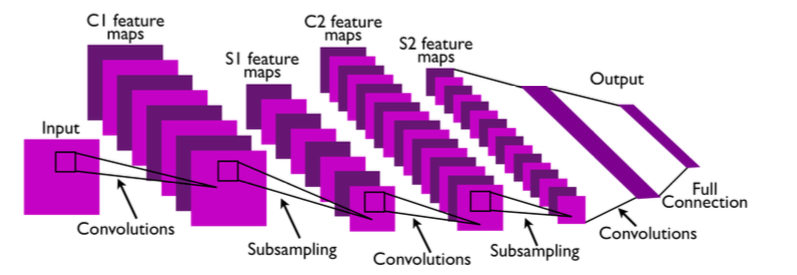

TensorFlowTutorials
================

Introduction to deep learning based on Google's TensorFlow framework. These tutorials are direct ports of
Newmu's [Theano Tutorials](https://github.com/Newmu/Theano-Tutorials)

***Topics***
* Simple Multiplication
* Linear Regression
* Logistic Regression
* Feedforward Neural Network (Multilayer Perceptron)
* Deep Feedforward Neural Network (Multilayer Perceptron with 2 Hidden Layers O.o)
* Convolutional Neural Network

***Dependencies***
* TensorFlow
* Numpy

***Convolution Network flow:***
* Get Image
* create Filters (calculated in training)
* do convolution -> Spatial Convolution (like Gabor filter, polarization)
* apply Tan & Abs (Activation function?)
* subsampling (will decrease the output size), Spatial Sub Sampling:
    * Compute the average (e.g. of 2x2 Pixels)
    * Multiply it by a trainable coefficient
    * Add trainable bias
* Convolution Map: convolute smaller images with filters in the same size. This
results into skalar numbers. Symmetrie breaking: convolute not all of the
images, but a randomly choosen subset -> training can explore different
features
* Linear classification: "y = Ax + b" (produces result 0 or 1)

***Things one should keep in mind:***
Disadvantage: Only finds features of defined size. Solution: Downsampling and
pyramid method

