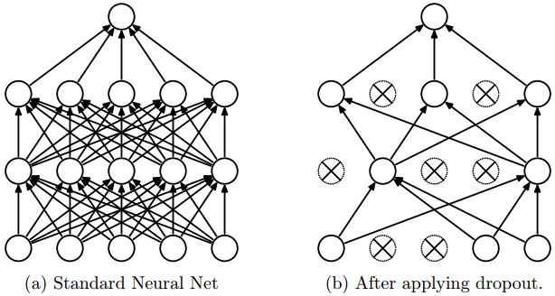

TensorFlowTutorials
================

Introduction to deep learning based on Google's TensorFlow framework. These tutorials are direct ports of
Newmu's [Theano Tutorials](https://github.com/Newmu/Theano-Tutorials)

***Topics***
* Simple Multiplication
* Linear Regression
* Logistic Regression
* Feedforward Neural Network (Multilayer Perceptron)
* Deep Feedforward Neural Network (Multilayer Perceptron with 2 Hidden Layers O.o)
* Convolutional Neural Network

***Dependencies***
* TensorFlow
* Numpy

***Convolution Network flow:***
* Get Image
* create Filters (calculated in training)
* do convolution -> Spatial Convolution (like Gabor filter, polarization)
* apply Tan & Abs (Activation function?)
* subsampling (will decrease the output size), Spatial Sub Sampling:
    * Compute the average (e.g. of 2x2 Pixels)
    * Multiply it by a trainable coefficient
    * Add trainable bias
* Convolution Map: convolute smaller images with filters in the same size. This
results into skalar numbers. Symmetrie breaking: convolute not all of the
images, but a randomly choosen subset -> training can explore different
features
* Linear classification: "y = Ax + b" (produces result 0 or 1)

***Things one should keep in mind:***
Disadvantage: Only finds features of defined size. Solution: Downsampling and
pyramid method

***Quick thoughts / Cites***
* Monitor fraction of "dead" neurons (?)
* "To give you some context, modern Convolutional Networks contain on orders of
100 million parameters and are usually made up of approximately 10-20 layers
(hence deep learning)."
* As an aside, in practice it is often the case that 3-layer neural networks
will outperform 2-layer nets, but going even deeper (4,5,6-layer) rarely helps
much more. This is in stark contrast to Convolutional Networks, where depth
has been found to be an extremely important component for a good
recognition system (e.g. on order of 10 learnable layers).
* Based on our discussion above, it seems that smaller neural networks can be
preferred if the data is not complex enough to prevent overfitting. However,
this is incorrect - there are many other preferred ways to prevent overfitting
in Neural Networks that we will discuss later
(such as L2 regularization, dropout, input noise).
In practice, it is always better to use these methods to control overfitting
instead of the number of neurons.
    * L2 regularization: `W += -lambda * W` and `lambda ~ 0.1
    * Dropout: Only set a subset of all neurons active (e.g. `p = 0.5`),
    deactivate the other ones.
    
        - _Note_: One need to rescale the output of each layer with `p`
        Alternatively use _inverted dropout_ (better performance)
* A more recent paper on this topic, Delving Deep into Rectifiers:
Surpassing Human-Level Performance on ImageNet Classification by He et al.,
derives an initialization specifically for ReLU neurons, reaching the
conclusion that the variance of neurons in the network should be
`2.0/n`. This gives the initialization `w = np.random.randn(n) * sqrt(2.0/n)`,
and is the current recommendation for use in practice.

***Layers of Convoluted NNs***
* INPUT: Input layer
* CONV: Convoluted Layers, Parameters:
    * Accepts a volume of size `W1 x H1 x D1`
    * Requires 4 hyper-parameters:
        - `K`, Number of filters (aka depth)
        - `F`, their spatial extent
        - `S`, the strides
        - `P`, amount of zero padding
    * Produces volume of size `W2 x H2 x D2`, where:
        - `W2 = (W1 - F + 2P)/S + 1`
        - `H2 = (H1 - F + 2P)/S + 1` (symmetry)
        - `D2 = K`
    * With parameter sharing, it introduces `F x F * D1` weights per filter, 
    for a total of `(F x F * D1) x K` weights and `K` biases.
    * In the output volume, the `d`-th depth slice (of size `W2 x H2`) is the 
    result of performing a valid convolution of the `d`-th filter over the 
    input volume with a stride of `S`, and then offset by `d`-th bias.
    * see [here](http://cs231n.github.io/assets/conv-demo/index.html) for a 
    demonstration
* RELU: Applies RELU (activation) function 
* POOL: subsampling any input
    * Accepts a volume of size `W1 x H1 x D1`
    * Requires three hyper-parameters:
        - `F`, their spatial extend
        - `S`, the stride
    * Produces a volume of size `W2 x H2 x D2` where:
        - `W2 = (W1 - F)/S + 1`
        - `H2 = (H1 - F)/S + 1` (symmetry)
        - `D2 = D1`
    * Introduces zero parameters since it computes a fixed function of the
     input
    * Most commonly: `F = 2, S = 2`, function: `f(xi) = max(xi)`
    * _Note_: zero-padding is not common in Pooling Layers
* FC: Fully connected layer
* Layer Patterns:
    * `INPUT -> [[CONV -> RELU]*N -> POOL?]*M -> [FC -> RELU]*K -> FC` with 
    `N >= 0` and `N <= 3`, `M >= 0`, `K >= 0` and `K < 3. Examples:
        - `INPUT -> [CONV -> RELU -> POOL]*2 -> FC -> RELU -> FC`
        - `INPUT -> [CONV -> RELU -> CONV -> RELU -> POOL]*3 -> [FC -> RELU]*2 -> FC`
    * _Hint_: Prefer a stack of small filter CONV to one large receptive field 
    CONV layer

***Useful links:***
* [ConvNets](http://cs231n.github.io/)
* [Do Deep Nets Really Need to be Deep?](http://arxiv.org/pdf/1312.6184v7.pdf)
* [Deep Learning](http://www.deeplearningbook.org)
* [FitNets: Hints for Thin Deep Nets](http://arxiv.org/pdf/1412.6550v4.pdf)
* [WTF Demo](http://cs.stanford.edu/people/karpathy/convnetjs/demo/classify2d.html)

